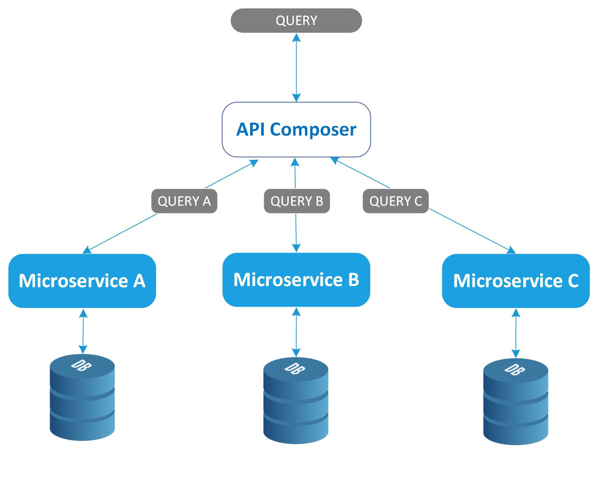
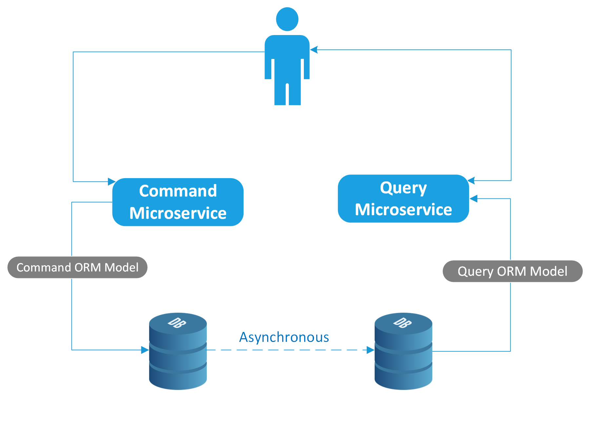
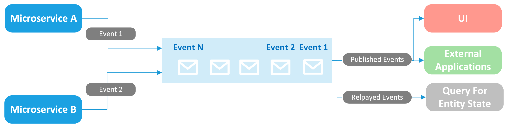
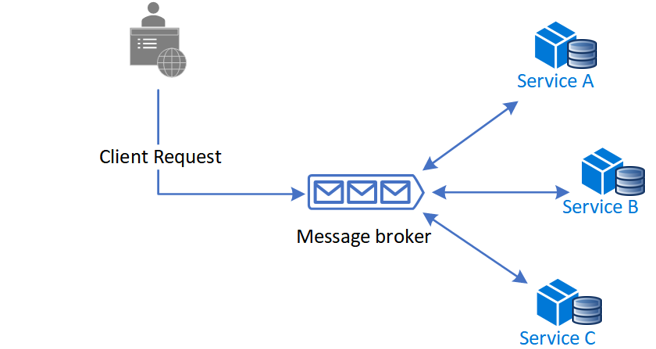
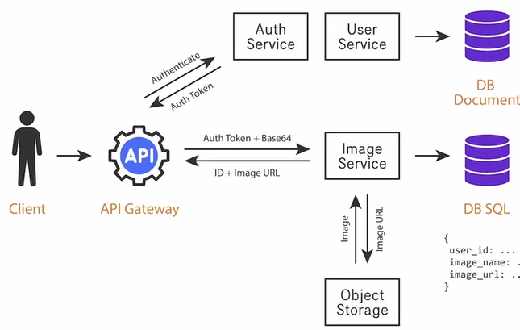
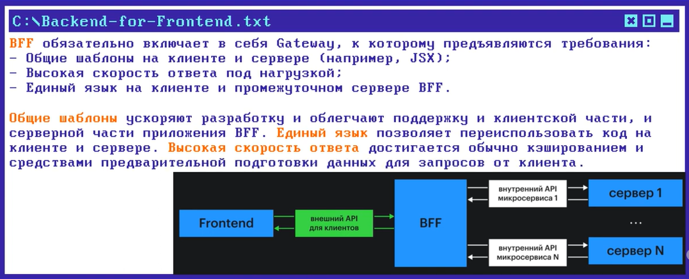

# Body Balance Application

## Описание
Приложение для здорового образа жизни, включающее функционал для добавления рецептов, 
тренировок и статей, отслеживания КБЖУ, общения между пользователями, 
а также модерации контента. 

## Основные возможности
- Регистрация и аутентификация пользователей.
- Управление контентом (рецепты, статьи, тренировки).
- Модерация контента через бота.
- Составление списка покупок для выбранных рецептов.
- Переписка между пользователями (приватные чаты и групповые).
- Уведомления о событиях (например, друг добавил новый рецепт в свой аккаунт).
- Аналитика и отчёты.
- Кэширование часто запрашиваемых данных.
- Логирование и мониторинг.
- CI/CD для автоматизации тестирования и развёртывания.

## Модули приложения
1. [Auth Service](./auth/README.md) - модуль аутентификации и авторизации
2. [User Data](./user-data/README.md) - управление пользователями
3. [Group Data](./group-data/README.md) - управление группами пользователей
4. [Content Article Data](./content-article-data/README.md)- управление статьями
5. [Content Recipe Data](./content-recipe-data/README.md)- управление рецептами
6. [Content Workout Data](./content-workout-data/README.md)- управление тренировками
7. [Content Cash](./content-cash/README.md) - кэширование контента
8. [Content Moderation](./content-moderation/README.md) - модерация контента через бота
9. [Messaging Service](./messaging/README.md) - переписка между пользователями
10. [Monitoring](./monitoring/README.md) - логирование и мониторинг
11. [Notification Service](./notification/README.md) - уведомления о действиях и событиях
12. [Search Service](./search/README.md) - функционал быстрого поиска с фильтрацией и сортировкой результатов
13. [Shopping List Service](./shopping-list/README.md)- управление списками покупок
14. [Subscription](./subscription/README.md) - модуль для управления подписками пользователей на других пользователей
15. [Analytics and Reporting Service](./analitics/README.md) - Сбор и анализ данных

## Стек технологий
- Java (Spring Boot)
- Spring Framework
- Swagger + OpenAPI
- Apache Kafka (например, для асинхронной модерации контента)
- PostgreSQL (жесткий диск)
- Redis (оперативная память - для реализации кэширования)
- ELK Stack (Elasticsearch, Logstash, Kibana)
- Docker
- Kubernetes (для оркестрации контейнеров)
- Amazon S3 / AWS S3 - Cloud Object Storage - хранилище бинарных данных (для хранения картинок/видео/аудио). Альтернатива: GCS / Azure / Minio

## Microservice Design Patterns и примеры использования в рамках приложения "Body Balance"

### Паттерны декомпозиции на микросервисы

| Pattern Name (EN)                 | Название паттерна (RU)                    | Description                                                                                          | Notes                                                                                               |
|-----------------------------------|-------------------------------------------|------------------------------------------------------------------------------------------------------|-----------------------------------------------------------------------------------------------------|
| Decompose by Business Capability   | Шаблон «Разбиение по бизнес-возможностям» | Key functions of the application are divided into separate microservices, like managing orders, delivery, notifications, etc. | Модули, которые разбила по функционалу: notification, search, content-moderation                    |
| Decompose by Subdomain             | Шаблон «Разбиение по поддоменам»          | Uses domain-driven design (DDD) to split the application into subdomains, with each subdomain having its own microservices.   | Модули, которые разбила по доменам: content-article-data, content-recipe-data, content-workout-data |

### Паттерны рефакторинга

| Pattern Name (EN)                 | Название паттерна (RU)                                      | Description                                                                                     | Notes |
|-----------------------------------|-------------------------------------------------------------|-------------------------------------------------------------------------------------------------|-------|
| Strangler                         | Шаблон «Душитель»                                           | Gradually migrates monolith to microservices by creating a facade that redirects requests.       | -     |
| Anti-Corruption Layer             | Шаблон «Уровень защиты от повреждений» (промежуточный слой) | Isolates legacy systems by using an intermediary layer that helps maintain independence between systems. | -     |

### Паттерны управления данными

| Pattern Name (EN)                      | Название паттерна (RU)                                                               | Description                                                                                                                                                                                                                                                                                                                                                                                                                                                                                                                                                                                                                                       | Notes                                               |
|----------------------------------------|--------------------------------------------------------------------------------------|---------------------------------------------------------------------------------------------------------------------------------------------------------------------------------------------------------------------------------------------------------------------------------------------------------------------------------------------------------------------------------------------------------------------------------------------------------------------------------------------------------------------------------------------------------------------------------------------------------------------------------------------------|-----------------------------------------------------|
| Database Per Service                   | Шаблон «База данных на сервис»                                                       | Each service has its own database to increase independence.                                                                                                                                                                                                                                                                                                                                                                                                                                                                                                                                                                                       |                                                     |
| API Composition                        | Шаблон «API-композиция»                                                              | Aggregates data from multiple services through a single API.                                                                                                                                                                                                                                                                                                                                                                                                                                                                                                                                |                                                     |
| CQRS    (command query responsibility) | Шаблон «Разделение команд и запросов»                                                | Separates read (query) and write (сommand) operations for data management.                                                                                                                                                                                                                                                                                                                                                                                                                                                                                                                  |                                                     |
| Event Sourcing (event log) 🤯            | Шаблон «Поиск событий» (источники событий, регистрация событий, генерация событий) | Saves state changes as events rather than directly storing the current state.    Это архитектурный шаблон, при котором все изменения, вносимые в состояние приложения, сохраняются в той последовательности, в которой они происходили в журнал событий.  Эти записи служат  как источником для получения **текущего состояния**, так и журналом аудита с информацией о состоянии приложения в каждый момент его существования.   Подходит для систем, которые работают с обработкой событий (с **брокерами сообщений** - брокер может хранить всю историю сообщений)         | -                                                   |
| Saga                                   | Шаблон «Сага»                                                                        | Manages distributed transactions through event chains or messages.                                                                                                                                                                                                                                                                                                                                                                                                                                                                                                                          | Возможно подойдет для реализации модерации контента |

### Паттерны коммуникации

| Pattern Name (EN)                 | Название паттерна (RU)                                                    | Description                                                                                                                                                                         | Notes                                                       |
|-----------------------------------|---------------------------------------------------------------------------|-------------------------------------------------------------------------------------------------------------------------------------------------------------------------------------|-------------------------------------------------------------|
| API Gateway                       | Шаблон «API-шлюз»                                                         | A single entry point for all microservices through an API gateway. Снижает связанность бэка и фронта. На стороне Gateway частые запросы могут кэшироваться        | Можно добавить после того как разобью на несколько сервисов |
| Backends for Frontends (BFF)       | Шаблон «Бэкенды для фронтендов» (разные бэкенды для разных интерфейсов)  | Separate backends for different user interfaces, such as mobile apps and web versions.                                        |                                                             |

### Паттерны построения пользовательского интерфейса

| Pattern Name (EN)                 | Название паттерна (RU)               | Description                                                                                             | Notes |
|-----------------------------------|--------------------------------------|---------------------------------------------------------------------------------------------------------|-------|
| Client-Side UI Composition        | Шаблон «Сборка пользовательского интерфейса на стороне клиента» | UI HTML markup is generated and updated directly in the browser, with different fragments provided by various microservices. |       |
| Server-Side Page Fragment Composition | Шаблон «Сборка фрагментов страниц на стороне сервера» | UI fragments are assembled on the server side, and the client receives a fully rendered page, improving load speed. |       |

### Паттерны обнаружения сервисов

| Pattern Name (EN)                 | Название паттерна (RU)               | Description                                                                                             | Notes |
|-----------------------------------|--------------------------------------|---------------------------------------------------------------------------------------------------------|-------|
| Client-Side Service Discovery     | Шаблон «Обнаружение сервисов на стороне клиента» | The client interacts directly with the service registry to obtain information about available service instances. |       |
| Server-Side Service Discovery     | Шаблон «Обнаружение сервисов на стороне сервера» | The deployment platform handles registration, discovery, and routing requests to services based on DNS names. |       |

### Паттерны развертывания микросервисов

| Pattern Name (EN)                 | Название паттерна (RU)                      | Description                                                                                             | Notes |
|-----------------------------------|---------------------------------------------|---------------------------------------------------------------------------------------------------------|-------|
| Service Instance Per Host         | Шаблон «Экземпляр сервиса на хост»          | Each instance of a service is deployed on a separate host (virtual or physical), ensuring isolation.      |       |
| Blue-Green Deployment             | Шаблон «Сине-зеленое развертывание»         | A blue (current) environment serves traffic while a green (new) environment is deployed for testing, allowing quick rollback in case of errors. |       |

### Паттерны повышения отказоустойчивости

| Pattern Name (EN)                 | Название паттерна (RU)                | Description                                                                                             | Notes |
|-----------------------------------|---------------------------------------|---------------------------------------------------------------------------------------------------------|-------|
| Circuit Breaker                   | Шаблон «Автоматический выключатель»   | Prevents repeated failed requests between microservices by stopping them after a certain threshold of failures. |       |
| Bulkhead                          | Шаблон «Переборка»                    | Isolates resources, ensuring that failures in one service don’t affect other services.                  |       |

### Паттерны мониторинга микросервисов

| Pattern Name (EN)                 | Название паттерна (RU)                    | Description                                                                                                                                                                                                                                                                                | Notes                                                                                                                                                                                                                                                                        |
|-----------------------------------|-------------------------------------------|--------------------------------------------------------------------------------------------------------------------------------------------------------------------------------------------------------------------------------------------------------------------------------------------|------------------------------------------------------------------------------------------------------------------------------------------------------------------------------------------------------------------------------------------------------------------------------|
| Log Aggregation                   | Шаблон «Агрегация логов»                  | Centralized service for collecting logs from each service instance, providing a single point for search and analysis. Это позволит отслеживать активность пользователей, состояние системы и реагировать на инциденты быстрее.                                                             | Модуль `monitoring`. Приложение состоит из разных модулей (логи будут генерироваться в разных местах), но за счет агрегации логов с помощью ELK стека (Elasticsearch, Logstash, Kibana) собираем все логи в единую систему.                                                  |
| Distributed Tracing               | Шаблон «Распределенная трассировка»       | Assigns a unique ID to each external request, allowing tracking of how it is processed by different services.  В приложении с микросервисной архитектурой распределённое трассирование помогает отслеживать цепочку вызовов между сервисами и идентифицировать "узкие места" или сбои. | При публикации рецепта (действия: запрос на публикацию, сохранение в базу данных, проверка контента, обновление статуса рецепта).     **Производительность:** Можно измерить, сколько времени занимает каждая часть цепочки обработки запроса, и оптимизировать систему. |
| Health Check                      | Шаблон «Проверки здоровья»                | Each service defines a health endpoint, like `/health`, for monitoring and load balancers to periodically check the service’s status.                                                                                                                                                      | +                                                                                                                                                                                                                                                                            |

### Прочие паттерны проектирования микросервисов

| Pattern Name (EN)                 | Название паттерна (RU)                                           | Description                                                                                             | Notes |
|-----------------------------------|------------------------------------------------------------------|---------------------------------------------------------------------------------------------------------|-------|
| Ambassador                        | Шаблон «Посредник»                                               | Places client frameworks and libraries into a helper service that acts as a proxy between the client and other services. |       |
| Sidecar                           | Шаблон «Коляска» (Прицеп)                                        | A separate component handling peripheral tasks (e.g., monitoring, security) running alongside the main service. |       |
| Consumer-Driven Contract Testing  | Шаблон «Тестирование контрактов, ориентированных на потребителя» | Each service is tested against automated test contracts written by developers of other services (consumers). |       |
| External Configuration            | Шаблон «Внешняя конфигурация»                                    | Stores all configurations in an external repository, reducing security risks and allowing independent deployment of the configuration. | +     |

