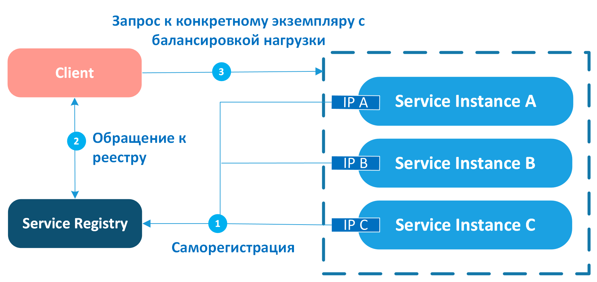
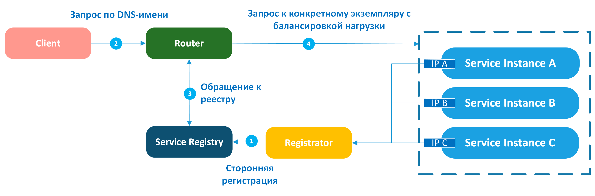
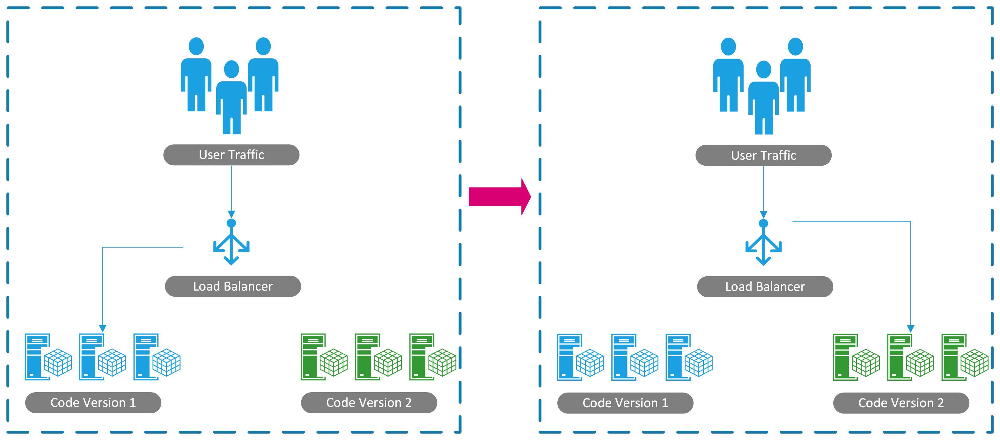
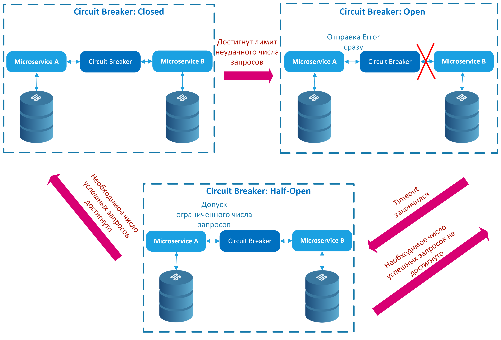
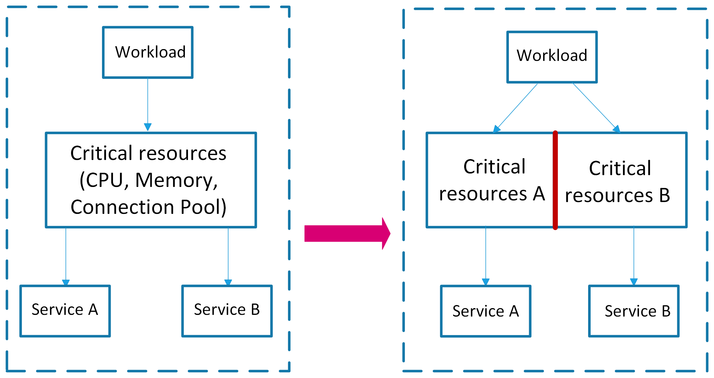
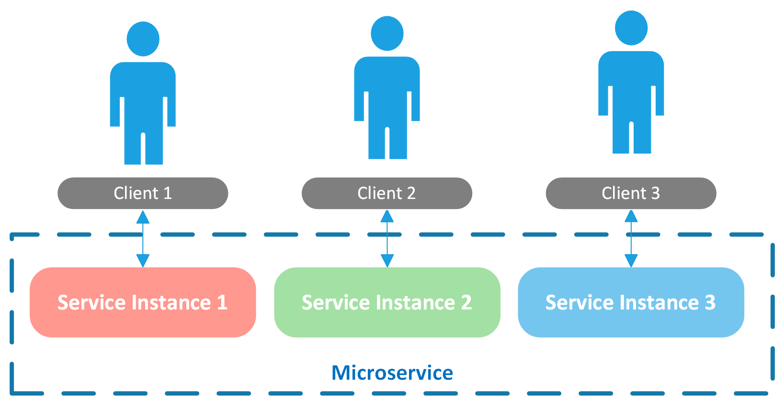
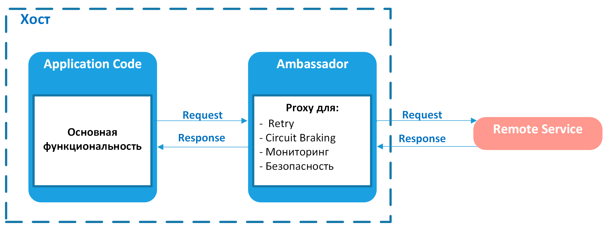
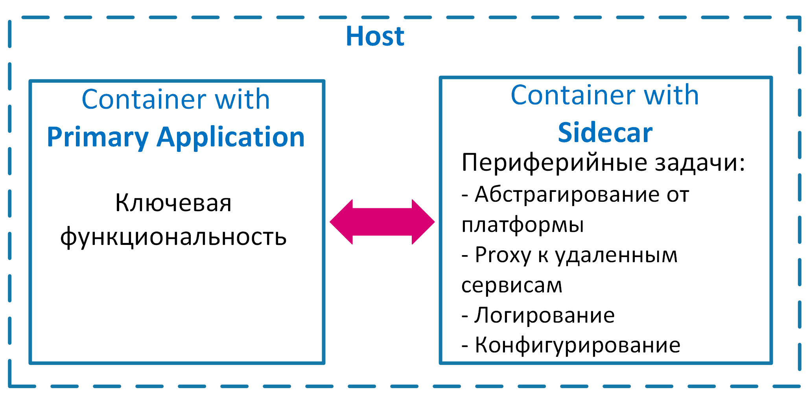

# Body Balance Application

## Описание
Приложение для здорового образа жизни, включающее функционал для добавления рецептов, 
тренировок и статей, отслеживания КБЖУ, общения между пользователями, 
а также модерации контента. 

## Основные возможности
- Регистрация и аутентификация пользователей.
- Управление контентом (рецепты, статьи, тренировки).
- Модерация контента через бот.
- Составление списка покупок для выбранных рецептов.
- Переписка между пользователями (приватные чаты и групповые).
- Уведомления о событиях (например, друг добавил новый рецепт в свой аккаунт).
- Аналитика и отчёты.
- Кэширование часто запрашиваемых данных.
- Логирование и мониторинг.
- CI/CD для автоматизации тестирования и развёртывания.

## Модули приложения
1. [Auth Service](./auth/README.md) - модуль аутентификации и авторизации
2. [User Service](./user/README.md) - управление пользователями / группами пользователей / подписками на пользователей
4. [Media Service](media/README.md)- управление статьями
5. [Recipe Service](./recipe/README.md)- управление рецептами
7. [Messaging Service](./messaging/README.md) - переписка между пользователями
8. [Notification Service](./notification/README.md) - уведомления о действиях и событиях
9. [Search Service](./search/README.md) - функционал быстрого поиска с фильтрацией и сортировкой результатов
10. [Shopping List Service](./shopping/README.md)- управление списками покупок

### Стек технологий
- Java (Spring Boot)
- Spring Framework
- Swagger + OpenAPI
- Apache Kafka (например, для асинхронной модерации контента)
- PostgreSQL (жесткий диск)
- MongoDB (для информации о рецептах) 🔥
- Redis (оперативная память - для реализации кэширования)
- Docker
- Kubernetes (для оркестрации контейнеров)
- Amazon S3 / AWS S3 - Cloud Object Storage - хранилище бинарных данных (для хранения картинок/видео/аудио). Альтернатива: GCS / Azure / Minio
- Hazelcast / Redis для распределенного кеширования
- AWS

## Дополнительная информация 

- Для сбора метрик (построение аналитики) и логирования все сервисы централизованно отправляют данные о пользовательских действиях в общую БД для хранения всей информации в одном месте (куда писать логи? : Kafka / ELK (Elasticsearch, Logstash, Kibana(средство для визуализации)) / Clickhouse)
- Логирование реализовано на основе slf4j ([log4j2])(https://docs.spring.io/spring-boot/how-to/logging.html)
- Реализован централизованный мониторинг состояния сервисов

### Стек технологий
- slf4j
- ELK Stack (Elasticsearch, Logstash, Kibana)
- Node Exporter
- Prometheus
- Grafana
- Spring Boot Actuator

## Microservice Design Patterns и примеры использования в рамках приложения "Body Balance"

### Паттерны декомпозиции на микросервисы

| Pattern Name (EN)                 | Название паттерна (RU)                    | Description                                                                                          | Notes                                                                                               |
|-----------------------------------|-------------------------------------------|------------------------------------------------------------------------------------------------------|-----------------------------------------------------------------------------------------------------|
| Decompose by Business Capability   | Шаблон «Разбиение по бизнес-возможностям» | Key functions of the application are divided into separate microservices, like managing orders, delivery, notifications, etc. | Модули, которые разбила по функционалу: notification, search, content-moderation                    |
| Decompose by Subdomain             | Шаблон «Разбиение по поддоменам»          | Uses domain-driven design (DDD) to split the application into subdomains, with each subdomain having its own microservices.   | Модули, которые разбила по доменам: content-article-data, content-recipe-data, content-workout-data |

### Паттерны рефакторинга

| Pattern Name (EN)                 | Название паттерна (RU)                                      | Description                                                                                     | Notes |
|-----------------------------------|-------------------------------------------------------------|-------------------------------------------------------------------------------------------------|-------|
| Strangler                         | Шаблон «Душитель»                                           | Gradually migrates monolith to microservices by creating a facade that redirects requests.       | -     |
| Anti-Corruption Layer             | Шаблон «Уровень защиты от повреждений» (промежуточный слой) | Isolates legacy systems by using an intermediary layer that helps maintain independence between systems. | -     |

### Паттерны управления данными

| Pattern Name (EN)                      | Название паттерна (RU)                                                               | Description                                                                                                                                                                                                                                                                                                                                                                                                                                                                                                                                                                                                                                                                                                                                                                                                                                                                                                                                         | Notes                                               |
|----------------------------------------|--------------------------------------------------------------------------------------|-----------------------------------------------------------------------------------------------------------------------------------------------------------------------------------------------------------------------------------------------------------------------------------------------------------------------------------------------------------------------------------------------------------------------------------------------------------------------------------------------------------------------------------------------------------------------------------------------------------------------------------------------------------------------------------------------------------------------------------------------------------------------------------------------------------------------------------------------------------------------------------------------------------------------------------------------------|-----------------------------------------------------|
| Database Per Service                   | Шаблон «База данных на сервис»                                                       | Each service has its own database to increase independence.                                                                                                                                                                                                                                                                                                                                                                                                                                                                                                                                                                                                                                                                                                                                                                                                                                                                                         |                                                     |
| API Composition                        | Шаблон «API-композиция»                                                              | Aggregates data from multiple services through a single API.                                                                                                                                                                                                                                                                                                                                                                                                                                                                                                                                                                                                                                                                                                                                                                                                                                  |                                                     |
| CQRS    (command query responsibility) | Шаблон «Разделение команд и запросов»                                                | Separates read (query) and write (сommand) operations for data management.                                                                                                                                                                                                                                                                                                                                                                                                                                                                                                                                                                                                                                                                                                                                                                                                                    |                                                     |
| Event Sourcing (event log) 🤯            | Шаблон «Поиск событий» (источники событий, регистрация событий, генерация событий) | Saves state changes as events rather than directly storing the current state.    Это архитектурный шаблон, при котором все изменения, вносимые в состояние приложения, сохраняются в той последовательности, в которой они происходили в журнал событий.  Эти записи служат  как источником для получения **текущего состояния**, так и журналом аудита с информацией о состоянии приложения в каждый момент его существования.   Подходит для систем, которые работают с обработкой событий (с **брокерами сообщений** - брокер может хранить всю историю сообщений)                                                                                                                                                                                                                                                                                                           | -                                                   |
| Saga                                   | Шаблон «Сага»                                                                        | Manages distributed transactions through event chains or messages.      При использовании паттерна каждая локальная транзакция обновляет данные в хранилище в рамках одного микросервиса и публикует событие или сообщение, которые, в свою очередь, запускают следующую локальную транзакцию и так далее. Если локальная транзакция завершается с ошибкой, выполняется серия компенсирующих транзакций, которые отменяют изменения предыдущих транзакций.     **Для координации транзакций существует два основных способа:**    **Хореография**. Децентрализованная координация, при которой каждый микросервис прослушивает события/сообщения другого микросервиса и решает, следует предпринять действие или нет.    **Оркестровка**. Централизованная координация, при которой отдельный компонент (оркестратор) сообщает микросервисам, какое действие необходимо выполнить далее.    | Возможно подойдет для реализации модерации контента |

### Паттерны коммуникации

| Pattern Name (EN)                 | Название паттерна (RU)                                                    | Description                                                                                                                                                                                                                                                                                                                                                                                                                                                                                                                                                                                                                                                                                                                                                                                        | Notes                                                       |
|-----------------------------------|---------------------------------------------------------------------------|----------------------------------------------------------------------------------------------------------------------------------------------------------------------------------------------------------------------------------------------------------------------------------------------------------------------------------------------------------------------------------------------------------------------------------------------------------------------------------------------------------------------------------------------------------------------------------------------------------------------------------------------------------------------------------------------------------------------------------------------------------------------------------------------------|-------------------------------------------------------------|
| API Gateway                       | Шаблон «API-шлюз»                                                         | A single entry point for all microservices through an API gateway.    Снижает связанность бэка и фронта. На стороне Gateway частые запросы могут кэшироваться     **В зависимости от конкретной цели использования паттерна иногда выделяют следующие его разновидности:**    **Gateway Routing**. Шлюз используется как обратный Proxy, перенаправляющий запросы клиента на соответствующий сервис.   Gateway Aggregation. Шлюз используется для разветвления клиентского запроса на несколько микросервисов и возвращения агрегированных ответов клиенту.   Gateway Offloading. Шлюз решает сквозные задачи, которые являются общими для сервисов: аутентификация, авторизация, SSL, ведение журналов и так далее.      | Можно добавить после того как разобью на несколько сервисов |
| Backends for Frontends (BFF)       | Шаблон «Бэкенды для фронтендов» (разные бэкенды для разных интерфейсов)  | Separate backends for different user interfaces, such as mobile apps and web versions.                                                                                                                                                                                                                                                                                                                                                                                                                                                                                                                                                                                                                                                       |                                                             |

### Паттерны построения пользовательского интерфейса

| Pattern Name (EN)                 | Название паттерна (RU)               | Description                                                                                                                    | Notes |
|-----------------------------------|--------------------------------------|--------------------------------------------------------------------------------------------------------------------------------|-------|
| Client-Side UI Composition        | Шаблон «Сборка пользовательского интерфейса на стороне клиента» | UI HTML markup is generated and updated directly in the browser, with different fragments provided by various microservices.   |       |
| Server-Side Page Fragment Composition | Шаблон «Сборка фрагментов страниц на стороне сервера» | UI fragments are assembled on the server side, and the client receives a fully rendered page, improving load speed.            |       |

### Паттерны обнаружения сервисов

| Pattern Name (EN)                 | Название паттерна (RU)               | Description                                                                                                                                    | Notes |
|-----------------------------------|--------------------------------------|------------------------------------------------------------------------------------------------------------------------------------------------|-------|
| Client-Side Service Discovery     | Шаблон «Обнаружение сервисов на стороне клиента» | The client interacts directly with the service registry to obtain information about available service instances.    |       |
| Server-Side Service Discovery     | Шаблон «Обнаружение сервисов на стороне сервера» | The deployment platform handles registration, discovery, and routing requests to services based on DNS names.                              |       |

### Паттерны развертывания микросервисов

| Pattern Name (EN)                 | Название паттерна (RU)                      | Description                                                                                                                                                                                                                                                                                                                                                                                                                                                                                                                                                                                                                                                                             | Notes |
|-----------------------------------|---------------------------------------------|-----------------------------------------------------------------------------------------------------------------------------------------------------------------------------------------------------------------------------------------------------------------------------------------------------------------------------------------------------------------------------------------------------------------------------------------------------------------------------------------------------------------------------------------------------------------------------------------------------------------------------------------------------------------------------------------|-------|
| Service Instance Per Host         | Шаблон «Экземпляр сервиса на хост»          | Each instance of a service is deployed on a separate host (virtual or physical), ensuring isolation.     При переходе на микросервисную архитектуру рекомендуется проводить развертывание каждого экземпляра сервиса на собственном хосте (виртуальном или физическом). Паттерн Service Instance Per Host позволяет изолировать экземпляры сервисов друга от друга, избежать конфликтов версий и требований к ресурсам, максимально использовать ресурсы хоста, а также легче и быстрее проводить повторные развертывания. К недостаткам паттерна можно отнести потенциально менее эффективное использование ресурсов по сравнению с развертыванием нескольких экземпляров на хост. | +     |
| Blue-Green Deployment             | Шаблон «Сине-зеленое развертывание»         | A blue (current) environment serves traffic while a green (new) environment is deployed for testing, allowing quick rollback in case of errors.                                                                                                                                                                                                                                                                                                                                                                                                                                                                                                                                     |       |

### Паттерны повышения отказоустойчивости

| Pattern Name (EN)                 | Название паттерна (RU)                | Description                                                                                                                                                                                                                                                                                                                                                                                                                                                                                                                                                                                                                                                                                                                                                                                                                                                                                                                                                                                                                                                                                                                                                                                                                                                                                                                                                                                                                                                                                                                                                                                                                                                                                    | Notes |
|-----------------------------------|---------------------------------------|------------------------------------------------------------------------------------------------------------------------------------------------------------------------------------------------------------------------------------------------------------------------------------------------------------------------------------------------------------------------------------------------------------------------------------------------------------------------------------------------------------------------------------------------------------------------------------------------------------------------------------------------------------------------------------------------------------------------------------------------------------------------------------------------------------------------------------------------------------------------------------------------------------------------------------------------------------------------------------------------------------------------------------------------------------------------------------------------------------------------------------------------------------------------------------------------------------------------------------------------------------------------------------------------------------------------------------------------------------------------------------------------------------------------------------------------------------------------------------------------------------------------------------------------------------------------------------------------------------------------------------------------------------------------------------------------|-------|
| Circuit Breaker                   | Шаблон «Автоматический выключатель»   | Prevents repeated failed requests between microservices by stopping them after a certain threshold of failures.    При взаимодействии микросервисов не исключены ситуации, когда по какой-то причине один из сервисов перестает отвечать. Справиться с временными сбоями (медленное сетевое соединение, временная недоступность и так далее) помогают повторные вызовы. Однако при более серьезных сбоях, вызванных полным отказом сервиса, повторные вызовы будут лишь расходовать ресурсы.    В таких случаях рекомендуется использовать шаблон Circuit Breaker. Микросервис будет запрашивать другой микросервис через Proxy-сервер. Он подсчитывает количество недавних сбоев и на основе него определяет, разрешать ли выполнение последующих вызовов или немедленно возвращать исключение.    Proxy-сервер может находиться в трех состояниях:   Closed. Идет передача запросов между сервисами и подсчет количества сбоев. Если число сбоев за заданный интервал времени превышает пороговое значение, выключатель Proxy-сервера переводится в состояние Open.  Open. Запросы от исходного сервиса немедленно возвращаются с ошибкой. По истечении заданного тайм-аута выключатель переводится в состояние Half-Open.   Half-Open. Выключатель пропускает ограниченное количество запросов от исходного сервиса и подсчитывает число успешных запросов. Если необходимое количество достигнуто, выключатель переходит в состояние Closed, если нет — возвращается в статус Open.   Использование шаблона повышает отказоустойчивость и предотвращает каскадные сбои, но требует тщательной настройки и мониторинга.    |       |
| Bulkhead                          | Шаблон «Переборка»                    | Isolates resources, ensuring that failures in one service don’t affect other services.              Еще один вариант использования шаблона — назначение каждому клиенту сервиса отдельного экземпляра сервиса. В таком случае, если один из клиентов сделает слишком много запросов, перегрузив свой экземпляр, другие клиенты смогут продолжить работу.                                                                                                                                                                                                                                                                                                                                                                                                                                                                                                                                                                                                                                                                                                                                                                                                                                                                                                                                                                                                                                                                                                                                                                                                                                                                                                  |       |

### Паттерны мониторинга микросервисов

| Pattern Name (EN)                 | Название паттерна (RU)                    | Description                                                                                                                                                                                                                                                                                | Notes                                                                                                                                                                                                                                                                        |
|-----------------------------------|-------------------------------------------|--------------------------------------------------------------------------------------------------------------------------------------------------------------------------------------------------------------------------------------------------------------------------------------------|------------------------------------------------------------------------------------------------------------------------------------------------------------------------------------------------------------------------------------------------------------------------------|
| Log Aggregation                   | Шаблон «Агрегация логов»                  | Centralized service for collecting logs from each service instance, providing a single point for search and analysis. Это позволит отслеживать активность пользователей, состояние системы и реагировать на инциденты быстрее.                                                             | Модуль `monitoring`. Приложение состоит из разных модулей (логи будут генерироваться в разных местах), но за счет агрегации логов с помощью ELK стека (Elasticsearch, Logstash, Kibana) собираем все логи в единую систему.                                                  |
| Distributed Tracing               | Шаблон «Распределенная трассировка»       | Assigns a unique ID to each external request, allowing tracking of how it is processed by different services.  В приложении с микросервисной архитектурой распределённое трассирование помогает отслеживать цепочку вызовов между сервисами и идентифицировать "узкие места" или сбои. | При публикации рецепта (действия: запрос на публикацию, сохранение в базу данных, проверка контента, обновление статуса рецепта).     **Производительность:** Можно измерить, сколько времени занимает каждая часть цепочки обработки запроса, и оптимизировать систему. |
| Health Check                      | Шаблон «Проверки здоровья»                | Each service defines a health endpoint, like `/health`, for monitoring and load balancers to periodically check the service’s status.                                                                                                                                                      | +                                                                                                                                                                                                                                                                            |

### Прочие паттерны проектирования микросервисов

| Pattern Name (EN)                 | Название паттерна (RU)                                           | Description                                                                                                                                                                                                                                                                                                                                                                                                                                                                           | Notes |
|-----------------------------------|------------------------------------------------------------------|---------------------------------------------------------------------------------------------------------------------------------------------------------------------------------------------------------------------------------------------------------------------------------------------------------------------------------------------------------------------------------------------------------------------------------------------------------------------------------------|-------|
| Ambassador                        | Шаблон «Посредник»                                               | Places client frameworks and libraries into a helper service that acts as a proxy between the client and other services.                                                                                                                                                                                                                                                                                                                                 |       |
| Sidecar                           | Шаблон «Коляска» (Прицеп)                                        | A separate component handling peripheral tasks (e.g., monitoring, security) running alongside the main service.          Паттерн Sidecar предлагает помещать периферийные задачи, связанные с мониторингом, безопасностью, отказоустойчивостью и так далее, в отдельный компонент и развертывать его внутри собственного процесса или контейнера. Так обеспечивается однородный интерфейс для сервисов основного приложения, которые могут быть написаны на разных языках.    |       |
| Consumer-Driven Contract Testing  | Шаблон «Тестирование контрактов, ориентированных на потребителя» | Each service is tested against automated test contracts written by developers of other services (consumers).                                                                                                                                                                                                                                                                                                                                                                          |       |
| External Configuration            | Шаблон «Внешняя конфигурация»                                    | Stores all configurations in an external repository, reducing security risks and allowing independent deployment of the configuration.                                                                                                                                                                                                                                                                                                                                                | +     |

